# Database ERD

Schema of the API's SQLite database, as defined in
[`server/src/db/migrations.ts`](../server/src/db/migrations.ts) (migrations 001–002).
All timestamps are epoch milliseconds (`INTEGER`).

```mermaid
erDiagram
    users ||--o{ user_roles : "has"
    roles ||--o{ user_roles : "assigned via"
    users |o--o{ user_roles : "granted_by"
    roles ||--o{ role_permissions : "grants"
    permissions ||--o{ role_permissions : "granted in"
    permissions ||--o{ permission_implications : "permission"
    permissions ||--o{ permission_implications : "implies"
    users ||--o{ sessions : "signs in on"
    users ||--o{ mfa_recovery_codes : "owns"
    users ||--o{ one_time_tokens : "receives"
    users ||--o{ articles : "authors"
    users |o..o{ audit_logs : "actor_id (no FK)"

    users {
        TEXT id PK "UUID"
        TEXT email UK "COLLATE NOCASE"
        TEXT name
        TEXT password_hash "argon2id PHC string"
        TEXT status "active | disabled"
        INTEGER email_verified_at "nullable"
        INTEGER failed_login_attempts
        INTEGER locked_until "nullable"
        TEXT mfa_secret_enc "AES-256-GCM, nullable"
        TEXT mfa_pending_secret_enc "during enrolment"
        INTEGER mfa_enabled_at "nullable"
        INTEGER mfa_last_used_step "TOTP replay guard"
        INTEGER password_changed_at
        INTEGER last_login_at
        INTEGER created_at
        INTEGER updated_at
    }

    roles {
        TEXT id PK "UUID"
        TEXT name UK
        TEXT description
        INTEGER is_system "1 = defined in code, read-only"
        INTEGER created_at
        INTEGER updated_at
    }

    permissions {
        TEXT name PK "resource:action e.g. articles:write"
        TEXT resource "e.g. articles"
        TEXT action "read | write | update:own ..."
        TEXT description
    }

    permission_implications {
        TEXT permission PK,FK "e.g. articles:write"
        TEXT implies PK,FK "e.g. articles:update:any"
    }

    role_permissions {
        TEXT role_id PK,FK "CASCADE"
        TEXT permission PK,FK "CASCADE"
    }

    user_roles {
        TEXT user_id PK,FK "CASCADE"
        TEXT role_id PK,FK "CASCADE"
        TEXT granted_by FK "users.id, SET NULL"
        INTEGER granted_at
    }

    sessions {
        TEXT id PK "UUID, first half of refresh token"
        TEXT user_id FK "CASCADE"
        TEXT token_hash "SHA-256 of current secret"
        TEXT prev_token_hash "reuse / race detection"
        INTEGER rotated_at
        TEXT ip
        TEXT user_agent
        INTEGER mfa_verified
        INTEGER created_at
        INTEGER last_used_at
        INTEGER expires_at "sliding, 7 days"
        INTEGER absolute_expires_at "hard cap, 30 days"
        INTEGER revoked_at "nullable"
        TEXT revoked_reason
    }

    mfa_recovery_codes {
        TEXT id PK
        TEXT user_id FK "CASCADE"
        TEXT code_hash "SHA-256"
        INTEGER used_at "nullable = unused"
    }

    one_time_tokens {
        TEXT id PK
        TEXT user_id FK "CASCADE"
        TEXT purpose "verify_email | reset_password"
        TEXT token_hash UK "SHA-256"
        INTEGER expires_at
        INTEGER used_at "nullable = unused"
        INTEGER created_at
    }

    articles {
        TEXT id PK
        TEXT author_id FK "CASCADE"
        TEXT title
        TEXT body
        TEXT status "draft | published"
        INTEGER published_at
        INTEGER created_at
        INTEGER updated_at
    }

    audit_logs {
        INTEGER id PK "AUTOINCREMENT"
        INTEGER at
        TEXT actor_id "logical ref, no FK"
        TEXT action "e.g. auth.login_failed"
        TEXT target_type
        TEXT target_id "logical ref, no FK"
        INTEGER success
        TEXT ip
        TEXT user_agent
        TEXT metadata "JSON"
    }

    schema_migrations {
        INTEGER version PK
        INTEGER applied_at
    }
```

## Domains

| Domain | Tables | Notes |
|---|---|---|
| **RBAC** | `roles`, `permissions`, `role_permissions`, `user_roles`, `permission_implications` | `users` ↔ `roles` and `roles` ↔ `permissions` are many-to-many. `permission_implications` is a self-referencing many-to-many (`articles:write` → `articles:update:any` → `articles:update:own`), expanded transitively with a recursive CTE to compute effective permissions. |
| **Authentication** | `users`, `sessions`, `mfa_recovery_codes`, `one_time_tokens` | Every child row cascades on user delete. The refresh token is `<sessions.id>.<secret>`; only a SHA-256 of the secret is stored. |
| **Audit** | `audit_logs` | Append-only. `actor_id` / `target_id` are intentionally **not** foreign keys, so history survives deletions. |
| **Example resource** | `articles` | Demonstrates RBAC + ownership (`update:own` vs `update:any`). |
| **Infrastructure** | `schema_migrations` | Forward-only migration tracking. |

## Secrets at rest

| Column | Protection |
|---|---|
| `users.password_hash` | Argon2id (m=19 MiB, t=2, p=1), PHC format |
| `users.mfa_secret_enc`, `mfa_pending_secret_enc` | AES-256-GCM with `DATA_ENCRYPTION_KEY` (must be readable to verify TOTP) |
| `sessions.token_hash`, `prev_token_hash` | SHA-256 |
| `mfa_recovery_codes.code_hash` | SHA-256 |
| `one_time_tokens.token_hash` | SHA-256 |

## Indexes

| Index | Purpose |
|---|---|
| `idx_user_roles_role (role_id)` | Count / list users of a role |
| `idx_sessions_user (user_id)` | List and revoke a user's sessions |
| `idx_recovery_user (user_id)` | Recovery code lookup |
| `idx_ott_user_purpose (user_id, purpose)` | Invalidate older links on reissue |
| `idx_audit_at (at DESC)` | Newest-first audit listing |
| `idx_audit_actor (actor_id)` | Filter audit log by actor |
| `idx_articles_author (author_id)` | Ownership queries |

Plus implicit indexes on every `PRIMARY KEY` and `UNIQUE` column (`users.email`, `roles.name`, `one_time_tokens.token_hash`).
