# Database ERD (MySQL 8)

Target schema for **MySQL 8.0+** (InnoDB, `utf8mb4`, default collation `utf8mb4_0900_ai_ci`).
Each column's comment starts with its constraints (`NOT NULL` / `NULL`, `UNIQUE`, `DEFAULT`,
`ON DELETE`), followed by notes. All `DATETIME(3)` values are stored in **UTC**.

> The running API currently uses SQLite ([`server/src/db/migrations.ts`](../server/src/db/migrations.ts),
> migrations 001–004). Same tables, keys and relationships; only the column types differ (see
> [Type mapping](#type-mapping-sqlite--mysql) below).

```mermaid
erDiagram
    users ||--o{ user_roles : "has"
    roles ||--o{ user_roles : "assigned via"
    users |o--o{ user_roles : "granted_by"
    roles ||--o{ role_permissions : "grants"
    permissions ||--o{ role_permissions : "granted in"
    users ||--o{ sessions : "signs in on"
    users ||--o{ mfa_recovery_codes : "owns"
    users ||--o{ one_time_tokens : "receives"
    users ||--o{ articles : "authors"
    users |o..o{ audit_logs : "actor_id (no FK)"

    users {
        CHAR(36) id PK "UUID"
        VARCHAR(255) email UK "NOT NULL, UNIQUE, case-insensitive collation"
        VARCHAR(100) name "NOT NULL"
        VARCHAR(255) password_hash "NOT NULL, argon2id PHC string"
        ENUM status "NOT NULL, DEFAULT 'active', ENUM('active','disabled')"
        DATETIME(3) email_verified_at "NULL"
        INT failed_login_attempts "NOT NULL, DEFAULT 0"
        DATETIME(3) locked_until "NULL, NULL = not locked"
        VARCHAR(255) mfa_secret_enc "NULL, AES-256-GCM"
        VARCHAR(255) mfa_pending_secret_enc "NULL, during enrolment"
        DATETIME(3) mfa_enabled_at "NULL"
        BIGINT mfa_last_used_step "NULL, TOTP replay guard"
        DATETIME(3) password_changed_at "NOT NULL"
        DATETIME(3) last_login_at "NULL"
        DATETIME(3) created_at "NOT NULL, DEFAULT CURRENT_TIMESTAMP(3)"
        DATETIME(3) updated_at "NOT NULL, DEFAULT CURRENT_TIMESTAMP(3) ON UPDATE"
    }

    roles {
        CHAR(36) id PK "UUID"
        VARCHAR(50) name UK "NOT NULL, UNIQUE"
        VARCHAR(300) description "NOT NULL, DEFAULT ''"
        BOOLEAN is_system "NOT NULL, DEFAULT FALSE, TRUE = seeded, no rename or delete"
        DATETIME(3) created_at "NOT NULL, DEFAULT CURRENT_TIMESTAMP(3)"
        DATETIME(3) updated_at "NOT NULL, DEFAULT CURRENT_TIMESTAMP(3) ON UPDATE"
    }

    permissions {
        INT id PK "AUTO_INCREMENT"
        VARCHAR(100) name UK "NOT NULL, UNIQUE, resource:action e.g. articles:publish"
        VARCHAR(50) resource "NOT NULL, e.g. articles"
        VARCHAR(50) action "NOT NULL, read | create | update:own ..."
        VARCHAR(300) description "NOT NULL"
    }

    role_permissions {
        CHAR(36) role_id PK,FK "NOT NULL, ON DELETE CASCADE"
        INT permission_id PK,FK "NOT NULL, ON DELETE CASCADE"
    }

    user_roles {
        CHAR(36) user_id PK,FK "NOT NULL, ON DELETE CASCADE"
        CHAR(36) role_id PK,FK "NOT NULL, ON DELETE CASCADE"
        CHAR(36) granted_by FK "NULL, ON DELETE SET NULL, users.id"
        DATETIME(3) granted_at "NOT NULL, DEFAULT CURRENT_TIMESTAMP(3)"
    }

    sessions {
        CHAR(36) id PK "UUID, first half of refresh token"
        CHAR(36) user_id FK "NOT NULL, ON DELETE CASCADE"
        CHAR(43) token_hash "NOT NULL, SHA-256 base64url of current secret"
        CHAR(43) prev_token_hash "NULL, reuse / race detection"
        DATETIME(3) rotated_at "NULL"
        VARCHAR(45) ip "NULL, fits IPv6"
        VARCHAR(512) user_agent "NULL"
        BOOLEAN mfa_verified "NOT NULL, DEFAULT FALSE"
        DATETIME(3) created_at "NOT NULL, DEFAULT CURRENT_TIMESTAMP(3)"
        DATETIME(3) last_used_at "NOT NULL"
        DATETIME(3) expires_at "NOT NULL, sliding, 7 days"
        DATETIME(3) absolute_expires_at "NOT NULL, hard cap, 30 days"
        DATETIME(3) revoked_at "NULL"
        VARCHAR(50) revoked_reason "NULL"
    }

    mfa_recovery_codes {
        CHAR(36) id PK "UUID"
        CHAR(36) user_id FK "NOT NULL, ON DELETE CASCADE"
        CHAR(43) code_hash "NOT NULL, SHA-256 base64url"
        DATETIME(3) used_at "NULL = unused"
    }

    one_time_tokens {
        CHAR(36) id PK "UUID"
        CHAR(36) user_id FK "NOT NULL, ON DELETE CASCADE"
        ENUM purpose "NOT NULL, ENUM('verify_email','reset_password')"
        CHAR(43) token_hash UK "NOT NULL, UNIQUE, SHA-256 base64url"
        DATETIME(3) expires_at "NOT NULL"
        DATETIME(3) used_at "NULL = unused"
        DATETIME(3) created_at "NOT NULL, DEFAULT CURRENT_TIMESTAMP(3)"
    }

    articles {
        CHAR(36) id PK "UUID"
        CHAR(36) author_id FK "NOT NULL, ON DELETE CASCADE"
        VARCHAR(200) title "NOT NULL"
        MEDIUMTEXT body "NOT NULL, up to 20000 chars"
        ENUM status "NOT NULL, DEFAULT 'draft', ENUM('draft','published')"
        DATETIME(3) published_at "NULL"
        DATETIME(3) created_at "NOT NULL, DEFAULT CURRENT_TIMESTAMP(3)"
        DATETIME(3) updated_at "NOT NULL, DEFAULT CURRENT_TIMESTAMP(3) ON UPDATE"
    }

    audit_logs {
        BIGINT id PK "AUTO_INCREMENT"
        DATETIME(3) at "NOT NULL, DEFAULT CURRENT_TIMESTAMP(3)"
        CHAR(36) actor_id "NULL, logical ref, no FK"
        VARCHAR(100) action "NOT NULL, e.g. auth.login_failed"
        VARCHAR(50) target_type "NULL, user | role | session | article"
        CHAR(36) target_id "NULL, logical ref, no FK"
        BOOLEAN success "NOT NULL, DEFAULT TRUE"
        VARCHAR(45) ip "NULL"
        VARCHAR(512) user_agent "NULL"
        JSON metadata "NULL"
    }

    schema_migrations {
        INT version PK
        DATETIME(3) applied_at "NOT NULL, DEFAULT CURRENT_TIMESTAMP(3)"
    }
```

## Domains

| Domain | Tables | Notes |
|---|---|---|
| **RBAC** | `roles`, `permissions`, `role_permissions`, `user_roles` | `users` ↔ `roles` and `roles` ↔ `permissions` are many-to-many. A user's permissions are every permission of every role they hold; permissions don't include each other. `permissions` has a surrogate `id` primary key, and `name` stays `UNIQUE` because it is what code checks. It is re-synced from code on every boot, matched by `name` (migration 003 dropped the former `permission_implications` table after copying implied permissions into `role_permissions`). System roles (`is_system = 1`) are created with defaults once, then their `role_permissions` are admin-editable, except `super_admin`, which is reset to every permission on boot. |
| **Authentication** | `users`, `sessions`, `mfa_recovery_codes`, `one_time_tokens` | Every child row cascades on user delete. The refresh token is `<sessions.id>.<secret>`; only a SHA-256 of the secret is stored. |
| **Audit** | `audit_logs` | Append-only. `actor_id` / `target_id` are intentionally **not** foreign keys, so history survives deletions. |
| **Example resource** | `articles` | Demonstrates RBAC + ownership (`update:own` vs `update:any`). |
| **Infrastructure** | `schema_migrations` | Forward-only migration tracking. With Flyway or Liquibase, their own history table replaces it. |

## Secrets at rest

| Column | Protection |
|---|---|
| `users.password_hash` | Argon2id (m=19 MiB, t=2, p=1), PHC format |
| `users.mfa_secret_enc`, `mfa_pending_secret_enc` | AES-256-GCM with `DATA_ENCRYPTION_KEY` (must be readable to verify TOTP) |
| `sessions.token_hash`, `prev_token_hash` | SHA-256 |
| `mfa_recovery_codes.code_hash` | SHA-256 |
| `one_time_tokens.token_hash` | SHA-256 |

## Indexes

| Index | Purpose |
|---|---|
| `idx_user_roles_role (role_id)` | Count / list users of a role |
| `idx_sessions_user (user_id)` | List and revoke a user's sessions |
| `idx_recovery_user (user_id)` | Recovery code lookup |
| `idx_ott_user_purpose (user_id, purpose)` | Invalidate older links on reissue |
| `idx_audit_at (at DESC)` | Newest-first audit listing |
| `idx_audit_actor (actor_id)` | Filter audit log by actor |
| `idx_articles_author (author_id)` | Ownership queries |

Plus implicit indexes on every `PRIMARY KEY` and `UNIQUE` column (`users.email`, `roles.name`, `permissions.name`, `one_time_tokens.token_hash`).

## Type mapping (SQLite → MySQL)

| SQLite (current app) | MySQL 8 | Used for |
|---|---|---|
| `TEXT` UUID | `CHAR(36)` | All `id` / `*_id` columns. `BINARY(16)` with `UUID_TO_BIN()` is smaller and faster if you don't need readable ids. |
| `INTEGER` epoch ms | `DATETIME(3)`, stored in UTC | All `*_at`, `locked_until`, `audit_logs.at` |
| `INTEGER` 0/1 | `BOOLEAN` (`TINYINT(1)`) | `is_system`, `mfa_verified`, `success` |
| `TEXT` + `CHECK (x IN …)` | `ENUM(…)` | `users.status`, `articles.status`, `one_time_tokens.purpose` |
| `TEXT` JSON | `JSON` | `audit_logs.metadata` |
| `TEXT COLLATE NOCASE` | `VARCHAR(255)` with the default `_ci` collation | `users.email` is case-insensitive by default in MySQL |
| `INTEGER PRIMARY KEY AUTOINCREMENT` | `INT` / `BIGINT AUTO_INCREMENT` | `permissions.id`, `audit_logs.id` |
| `TEXT` (short) | `VARCHAR(n)` | Names, hashes, IPs. SHA-256 base64url is always 43 chars, so `CHAR(43)` |
| `TEXT` (long) | `MEDIUMTEXT` | `articles.body` (20,000 chars × up to 4 bytes exceeds `TEXT`'s 64 KB) |

MySQL notes:
- Use **InnoDB** (required for foreign keys) and **`utf8mb4`**.
- InnoDB automatically indexes every foreign key column if no index covers it.
- Descending indexes (`at DESC`) are supported from MySQL 8.0.
