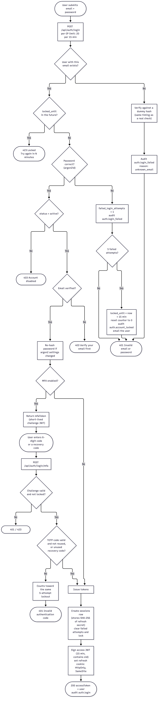
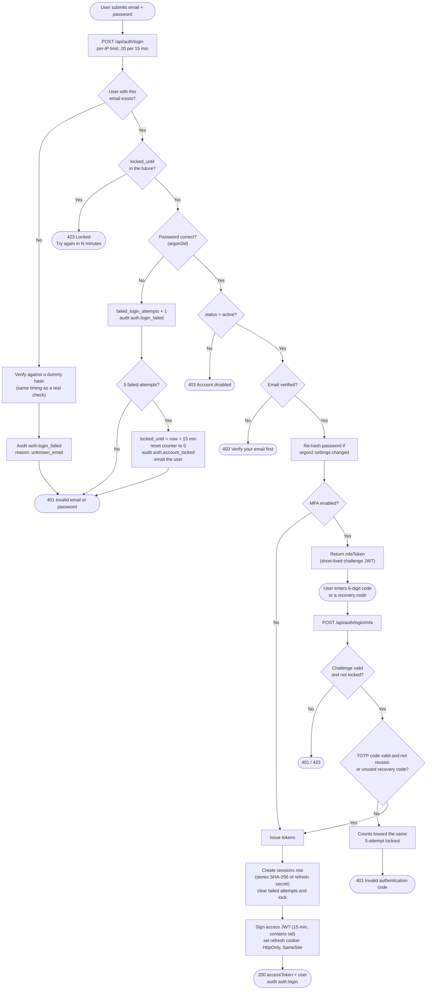

# Login (password, lockout, MFA)

Signing in with email and password, including account lockout and the optional
second factor. Code: [`auth.service.ts`](../../server/src/modules/auth/auth.service.ts) (`login`, `completeMfaLogin`).

