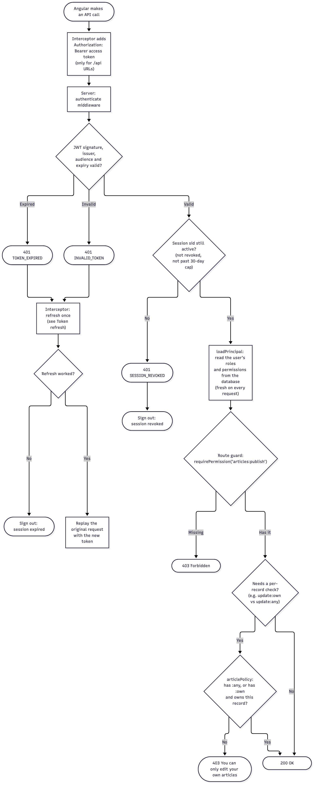
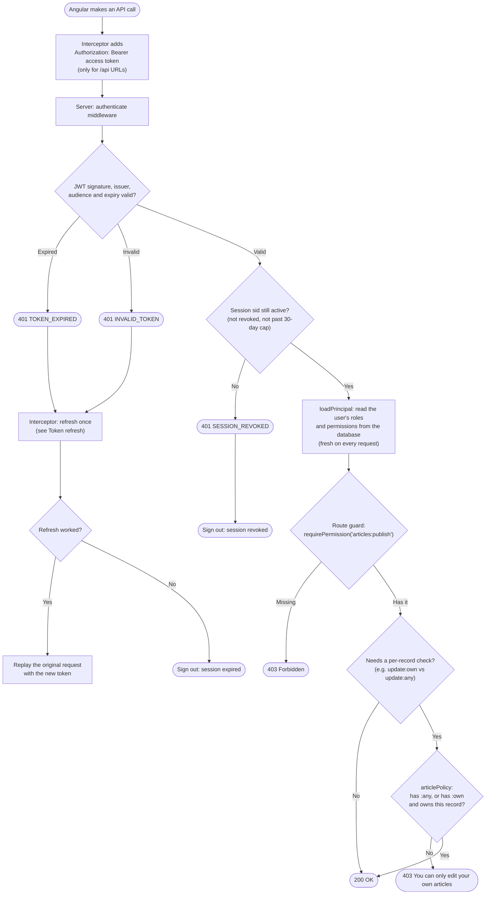

# API request authorization

What happens on every authenticated API call, from the Angular app to the
permission and ownership checks. Code: [`auth.interceptor.ts`](../../client/src/app/core/auth/auth.interceptor.ts),
[`middleware/auth.ts`](../../server/src/middleware/auth.ts), [`article.policy.ts`](../../server/src/modules/articles/article.policy.ts).

