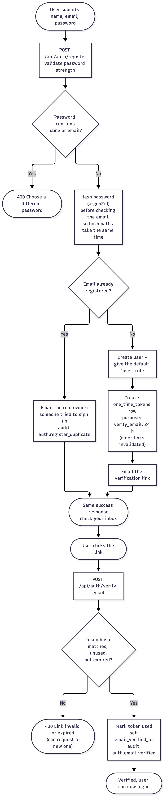
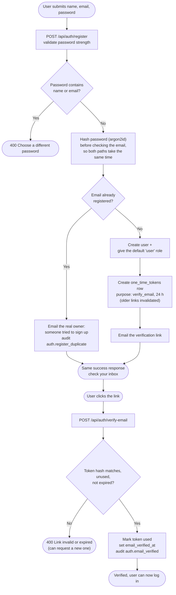

# Registration and email verification

Self-service sign-up. The response never reveals whether an email is already
registered. Code: [`auth.service.ts`](../../server/src/modules/auth/auth.service.ts) (`register`, `verifyEmail`).

