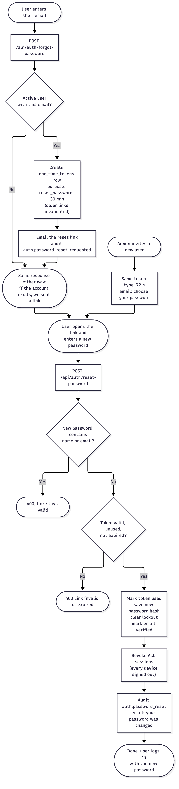
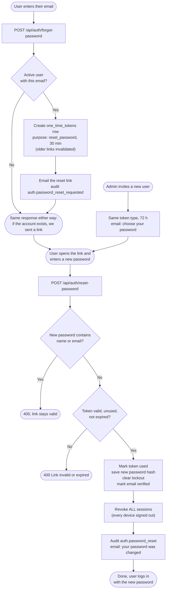

# Forgot password and reset

Resetting a forgotten password by email. Admin invitations use the same
"set your password" link with a 72-hour lifetime. Code: [`auth.service.ts`](../../server/src/modules/auth/auth.service.ts) (`forgotPassword`, `resetPassword`, `sendInvite`).

