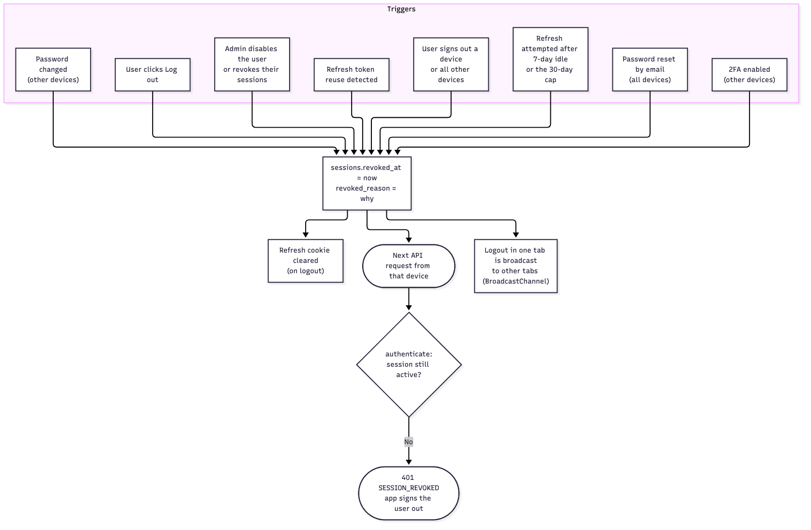
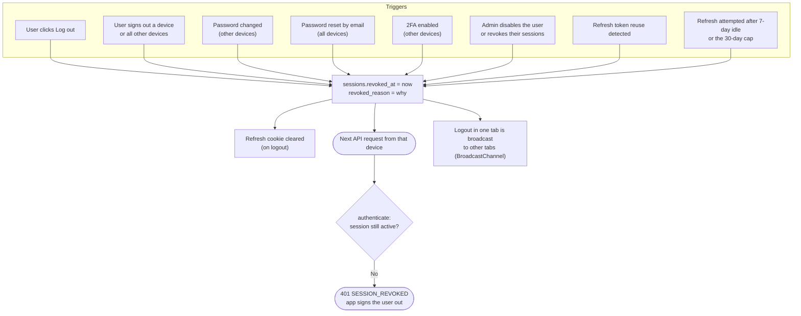

# Logout and session revocation

All the ways a session ends. Because every request checks the session row,
revocation takes effect immediately, not when the 15-minute access token expires.
Code: [`session.service.ts`](../../server/src/modules/auth/session.service.ts), [`auth.service.ts`](../../server/src/modules/auth/auth.service.ts).

